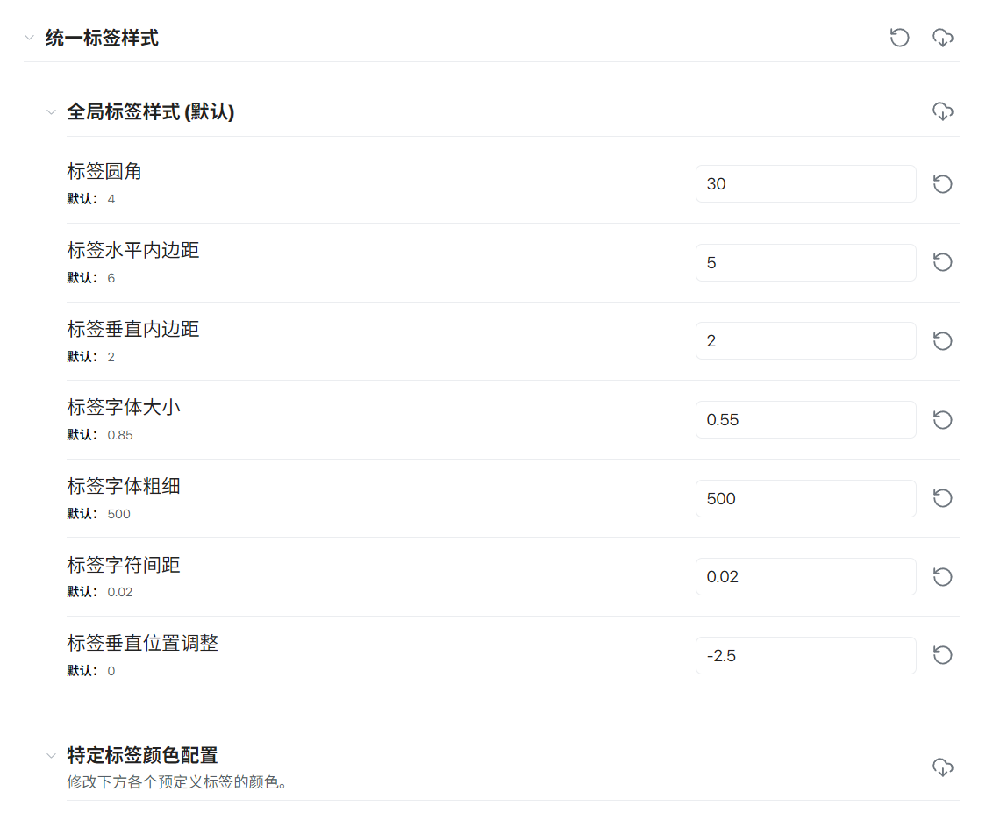
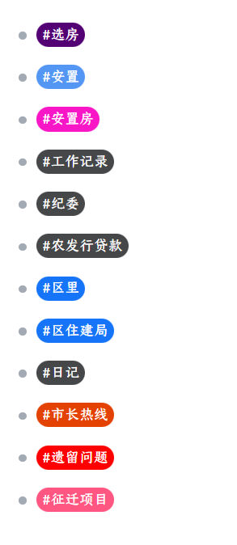

# Obsidian 统一标签样式 CSS 片段

本项目为 Obsidian 设计了统一且高度可定制的标签样式 CSS 代码，支持 Style Settings 插件和 Colored Tags 插件，方便你通过图形界面灵活调整标签外观。

## 功能简介
- **统一外观**：为不同模式下的标签提供一致的视觉样式（圆角、内边距、字体大小等）。
- **特定标签颜色**：支持为多达20个不同的标签分别设置背景色和文字颜色。
- **Style Settings 支持**：所有颜色和基础样式均可通过 Obsidian 的 Style Settings 插件进行可视化配置。
- **Live Preview 兼容**：依赖 Colored Tags 插件实现 Live Preview 下的自定义标签颜色。
- **源码/旧版编辑器兼容**：修复了标签分割等视觉问题。

## Style Settings 插件设置面板示例

## 标签样式效果示例

## 安装方法
1. 下载本仓库中的 CSS 文件（如 `unified-tag-styles.css`）。
2. 放入 Obsidian 的 CSS 片段目录。
3. 在 Obsidian 设置中启用该片段。
4. 推荐安装并启用 Style Settings 和 Colored Tags 插件。

## 详细说明
详细使用说明、依赖插件、参数配置方法等请参见仓库内文档和代码注释。

---

如有建议或问题，欢迎提 issue！
